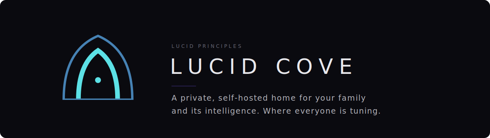
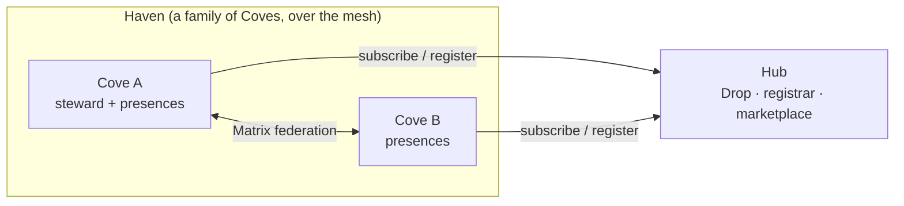
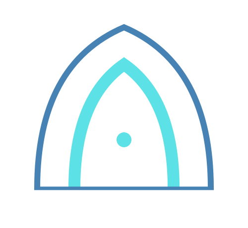

<p align="center">
  
</p>

# Lucid Cove

<!-- COPY: operator pass — final hero tagline in Chords' voice goes here -->
**A private, self-hosted family AI. Every family sovereign, connected by choice.**

[](./LICENSE)
[](#licensing)
[](#)
[](#development)

This is **Lucid Cove**: a self-hostable home for a person or a family and their intelligence agents. One generic container image; behavior defined entirely by configuration and per-instance overrides. It runs a Mission Control dashboard (FastAPI + scheduler), a team of role-based agents, a files layer (Nextcloud/WebDAV), voice and video, and the Lucid Tuning Protocol (LTP) for agent coherence. The same base runs a single personal agent or a full multi-presence family Cove — and it is built to be replicated, so another family can stand up their own.

> **Status: pre-release (v1.0.0).** Actively developed toward a public open-source launch. APIs and config schema may still change.

## What is Lucid Cove

A **Cove** is a self-contained, private home for a person or family and their agents — your data, your models, your machine. Coves stay private by default and connect only when you choose: a family of Coves is a **Haven**, and Havens coordinate through a shared **Hub**. It is built on the Lucid Principles framework, and every Cove subscribes to the same daily coherence signal (the Drop) while keeping its own writing, files, and identity entirely its own.

## What you get

- **Agents and presences.** A steward (coordinator), a merchant (commerce), and a build team of role-based agents — all defined in `config/cove.yaml`. A "presence" is a portable operator+agent unit; a Cove can hold one presence or a whole family.
- **Tunings and the daily Drop.** The Lucid Tuning Protocol gives every agent a signed, chained daily "tuning" plus a per-agent coherence loop. The public daily drop is at `drop.lucidprinciples.com`; the protocol and an independent client live in the separate [`ltp-core`](https://github.com/LucidPrinciples/ltp-core) package.
- **Connect / Matrix federation.** A private chat layer per Cove (Dendrite/Matrix) that federates by invitation across a Haven, so families talk Cove-to-Cove over the mesh without a central server owning the conversation.
- **Files (Nextcloud).** Each Cove runs its own Nextcloud instance for files, with WebDAV so agents and desktop sync see the same tree. Cross-presence sharing is explicit, folder by folder.
- **Voice and Jules.** A stateless WebDAV voice pipeline (pipecat) plus Jules, the voice presence — usable by any presence on any Cove.
- **Video pipeline.** Upload raw video and get transcript, moment detection, clips, and captioned renders; heavy transcode runs on whatever compute the operator chose (local GPU or rented).
- **GPU marketplace.** Rent-a-GPU so a laptop-only Cove gets the full pipeline, and idle GPU owners can offer compute over the encrypted mesh through a constrained pipeline. Fixed-price checkout at launch; vetted providers first, peers later.
- **Canonical Knowledge Base subscriber.** Read-only, signature-verified sync of the shared framework KB from the Hub. Your own writing is never overwritten.
- **Skills subsystem.** Loads `agentskills.io`-style skills behind a safety/prompt-injection gate (repo skills trusted; third-party surfaced for operator approval).
- **A provisioner.** `provision/` generates deploy-ready instances from a config file — the replication engine that lets another family stand up their own Cove.

## Design principle: clean is the moat

Do the specific things everyone needs, nothing more. The base stays lean; bloat is opt-in on top. Every feature should answer: *can another family run this?*

## Architecture (short version)

The container image is generic and carries no source — code is mounted at runtime and merged (`/cove-core/src` + `/overlay/src` → `/app/src`). Configuration layers `defaults < cove.yaml.example < your instance`. This is what makes one image serve every agent and every Cove.

```
Cove  ──┐   a self-contained family instance (this repo, one deploy)
Cove  ──┤
Cove  ──┴──►  Haven  ──►  Hub
             a family of      shared orchestration:
             connected        the Drop, registrar,
             Coves (mesh)      federation, marketplace
```



```
config/cove.yaml        your Cove: team, managers, tools, presences (overrides only)
provision/              the replication engine (generates instances from config)
src/                    the platform: dashboard, agents, tuning, knowledge, tools, skills
docker/                 Dockerfile, entrypoint, base SQL, migrations
```

## Getting started

**What you need:** [Docker](https://www.docker.com/products/docker-desktop/) (Desktop on Mac/Windows, Engine on Linux) and `git`. That's the whole list — everything else (database, Nextcloud, the app, HTTPS, voice) is pulled and built for you.

**Install — one command:**

```bash
curl -fsSL https://raw.githubusercontent.com/LucidPrinciples/lucid-cove/main/install.sh | bash
```

or from a clone:

```bash
git clone https://github.com/LucidPrinciples/lucid-cove.git
cd lucid-cove
bash install.sh
```

The installer checks for Docker (and points you to it if it's missing), then builds and starts your Cove. The first run pulls images and builds, so give it a few minutes. You don't edit any config files — the rest happens in the browser.

Run the installer again any time to stand up **another** Cove on the same machine — each run creates its own folder and picks free ports, and all Coves on the box share one Caddy. Re-running it *inside* an existing Cove's folder repairs/updates that Cove instead.

**Finish in the browser.** When it's done it prints a link. Open it and the setup wizard walks you through, in order:

1. **You** — your name, `@handle`, and email. This creates your identity (the handle is checked for uniqueness across the network, so no two people can claim the same one).
2. **Your Cove** — name it (also unique).
3. **Your agent** — Quick (pick an archetype and go) or Guided (walk through it). Your steward and the standard team come built in.
4. **Add intelligence** — connect a model so your agent can think: bring your own API key, or point at a local Ollama.

On the machine it's installed on, `http://localhost` works right away — including the microphone and voice (localhost is a secure context, so no certificate needed).

**Reach it from other devices (optional).** A Cove is private by default — nothing is exposed to the public internet. To use it from your phone or another computer:

- In Mission Control, **Claim your address** — a free `yourcove.lucidcove.org`, or your own domain (paste a Cloudflare token and DNS + HTTPS are set up for you).
- **Join the private network** — install Tailscale on each device and connect with the one-time code your Cove provides (see [`MESH.md`](./MESH.md)). Then open `https://yourcove.lucidcove.org` from anywhere, with real HTTPS and no ports to forward.

> **Advanced / scripted installs.** The installer wraps the provisioner in `provision/`, which generates a deploy-ready Cove from a config file. To customize (own domain at build time, pinned ports, compute backends, hosted vs self-host), write a config and run `python3 provision/centralized.py your.config.yaml --output ./out`. See `provision/` for the options.

## Links

<!-- COPY: operator pass — confirm final URLs / swap placeholders before launch -->

- **Lucid Principles framework** — https://lucidprinciples.com
- **The Lucid Path books** — [*The Lucid Path: Framework*](https://www.amazon.com/dp/B0H5T1HDFC) and [*The Lucid Path: Origins*](https://www.amazon.com/dp/B0H5TKL2WD)
- **Papers** — https://jasongarriotte.com/papers/
- **Lucid Cove (site)** — https://lucidcove.org
- **Lucid Cove app** — https://app.lucidcove.org
- **The daily Drop** — https://drop.lucidprinciples.com
- **Chords of Truth (YouTube)** — https://www.youtube.com/@LucidPrinciplesStories


## Licensing

- **Code:** Apache License 2.0 — see [`LICENSE`](./LICENSE).
- **Canon content** (the 22 Lucid Principles and quoted framework text): Creative Commons Attribution 4.0 (CC BY 4.0). Canon is quoted exactly and never generated or modified.

## Contributing

See [`CONTRIBUTING.md`](./CONTRIBUTING.md) for the branch-and-PR model, the protected-files list, and how the community pipeline works. Security reports go through [`SECURITY.md`](./SECURITY.md), not public issues.

## About

Built by [Lucid Principles, LLC](https://lucidprinciples.com). This repo is the production base — the founder’s family runs from these exact files. The framework books — [*The Lucid Path: Framework*](https://www.amazon.com/dp/B0H5T1HDFC) and [*The Lucid Path: Origins*](https://www.amazon.com/dp/B0H5TKL2WD) — are on Amazon.

---

<p align="center">
  <a href="https://lucidprinciples.com/vision/"></a>
</p>

<p align="center"><b>Lucid Principles</b><br>
<sub>A private, self-hosted home for your family and its intelligence. Where everyone is tuning.</sub></p>

<p align="center">
  <a href="https://lucidprinciples.com/vision/"><b>The Vision — every door in</b></a><br>
  <sub><a href="https://lucidcove.org">Lucid Cove</a> · <a href="https://app.lucidcove.org">The App</a> · <a href="https://drop.lucidprinciples.com">The Daily Drop</a> · <a href="https://jasongarriotte.com/papers/">Research</a> · <a href="https://lucidprinciples.com/canon/">The Canon</a></sub>
</p>
